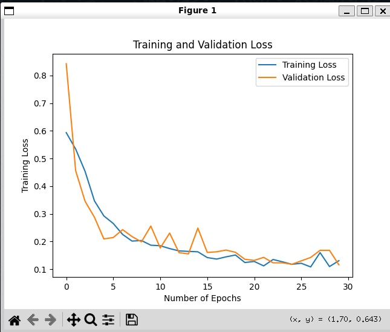
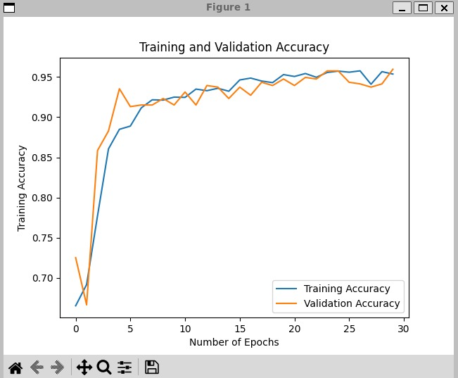
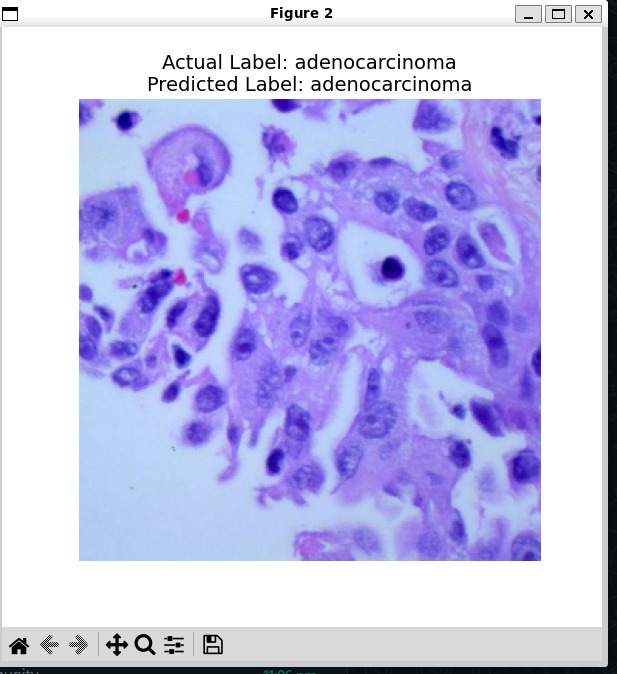

# LungOncoAI
This project builds a deep learning model using TensorFlow and Keras to classify lung CT scan images into one of three categories: Adenocarcinoma, Benign, or Squamous Cell Carcinoma.

## Dataset Structure
The dataset is split into:
- `Train/` – for training the model
- `Val/` – for validation during training
- `Test/` – for final evaluation

---

## Key Highlights
- Built with Convolutional Neural Networks (CNNs) with 6 convolutional layers
- Trained on labeled dataset with preprocessing and data augmentation
- Supports training, evaluation, and visualization
- Achieved **>95% accuracy** on training and validation sets
- Includes loss & accuracy plots for monitoring over 30 epochs

---

## Technologies Used
- Python 3.12
- TensorFlow 2.18
- Keras
- Matplotlib for visualization

---

### Training and Validation Loss

---

### Training and Validation Accuracy

---

### Final Result

